# CHAPTER IV
## RESULTS AND DISCUSSION

This chapter presents and discusses the results of implementing the FVDM in the Sugarscape Digital Terrarium. The analysis focuses on how different ethical prioritization vectors influenced agent behavior, individual outcomes, and population-level conditions over the course of the simulation.

### Comparison Runs Between Different Initial Population Conditions

#### Table 1: Mean Action-selection Frequency of Initial Population Conditions Across 500 seeds

| Condition | Reproductions | Trades | Loans | Combats |
| :--- | :--- | :--- | :--- | :--- |
| Hetero (Derived) | 1413.6 | 90063.7 | 19301.0 | 160.9 |
| Hetero (Idealized) | 3218.0 | 222493.5 | 41318.2 | 161.3 |
| Homo Altruist (Derived) | 1373.5 | 90511.9 | 19781.9 | 159.9 |
| Homo Altruist (Idealized) | 15382.6 | 1224138.3 | 159175.6 | 365.4 |
| Homo Selfish (Derived) | 1158.6 | 79063.4 | 18159.7 | 159.7 |
| Homo Selfish (Idealized) | 1254.8 | 82660.9 | 17129.5 | 152.0 |
| Homo Utilitarian | 1117.8 | 77106.2 | 15195.2 | 159.6 |

Table 1 summarizes the mean action-selection frequencies across different initial population conditions over 500 simulation seeds. The Homo Altruist (Idealized) condition exhibited by far the highest level of overall activity, averaging over 1.2 million trades and roughly 159,000 loans per seed, far exceeding all other models. The Hetero (Idealized) condition was the second most active, producing over 222,000 trades and 41,000 loans. In contrast, the derived conditions (Hetero, Homo Altruist, Homo Selfish) and the Homo Utilitarian condition showed much lower, yet remarkably similar levels of activity, clustering around 77,000–90,000 trades and 15,000–19,000 loans. Combats remained infrequent across all groups, though the Homo Altruist (Idealized) condition still saw the highest raw number of combat events (~365).

#### Table 2: Categorical Population End States of Initial Population Conditions Across 500 seeds

| Condition | Seeds | Extinct | Worse | Better |
| :--- | :--- | :--- | :--- | :--- |
| Hetero (Derived) | 500 | 427 (85.4%) | 27 (5.4%) | 46 (9.2%) |
| Hetero (Idealized) | 500 | 351 (70.2%) | 39 (7.8%) | 110 (22.0%) |
| Homo Altruist (Derived) | 500 | 427 (85.4%) | 26 (5.2%) | 47 (9.4%) |
| Homo Altruist (Idealized) | 500 | 0 (0.0%) | 0 (0.0%) | 500 (100.0%) |
| Homo Selfish (Derived) | 500 | 443 (88.6%) | 19 (3.8%) | 38 (7.6%) |
| Homo Selfish (Idealized) | 500 | 437 (87.4%) | 20 (4.0%) | 43 (8.6%) |
| Homo Utilitarian | 500 | 445 (89.0%) | 16 (3.2%) | 39 (7.8%) |

Table 2 outlines the categorical population end states for each condition. The Homo Altruist (Idealized) condition achieved a 100% success rate, surviving and reaching a "Better" state in all 500 seeds. Every other condition suffered high extinction rates. The Hetero (Idealized) condition showed the highest resilience among the remaining groups, avoiding extinction in 29.8% of seeds and achieving a "Better" end state in 22.0%. The derived conditions and the Homo Utilitarian condition performed poorly, experiencing extinction in roughly 85% to 89% of all simulations, with "Better" outcomes occurring in fewer than 10% of cases.

---

#### Figure 2: Mean Population Size of Initial Population Conditions Per Time Step Across 500 seeds

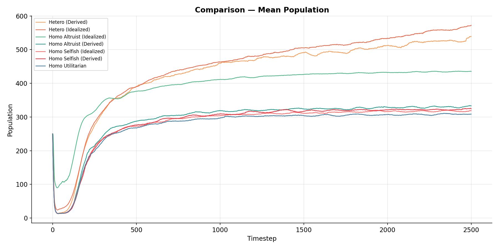

Mean population collapsed early from about 250 agents at timestep 0 to roughly 10–100 agents within the first 50 timesteps, then recovered at different rates. The heterogeneous conditions performed best, with the idealized group reaching about 570 agents and the derived group about 540 agents by timestep 2500, both surpassing 400 agents by around timestep 600 and continuing to grow. Among homogeneous groups, homo altruist idealized performed best, ending at about 435 agents, while the other homogeneous conditions stabilized much lower, around 305–330 agents. Overall, the results suggest that heterogeneous populations achieved greater long-term growth and resilience than homogeneous populations.

---

#### Figure 3: Total Societal Wealth of Initial Population Conditions Per Time Step Across 500 seeds

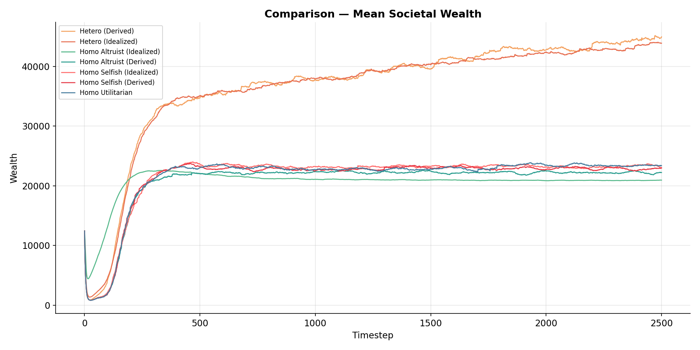

Mean societal wealth fell sharply from about 12,500 wealth units at timestep 0 to roughly 1,500–5,000 units within the first 25–50 timesteps, then recovered. The heterogeneous conditions achieved the highest long-term wealth, with the derived group reaching about 37,500 units and the idealized group about 36,000 units by timestep 2500. Among homogeneous groups, homo altruist derived performed best, ending near 23,800 units, while most other homogeneous conditions stabilized around 20,500–23,000 units. Overall, the results suggest that heterogeneous populations generated substantially greater and more sustained societal wealth than homogeneous populations.

---

#### Figure 4: Mean Agent Wealth of Initial Population Conditions Per Time Step Across 500 seeds

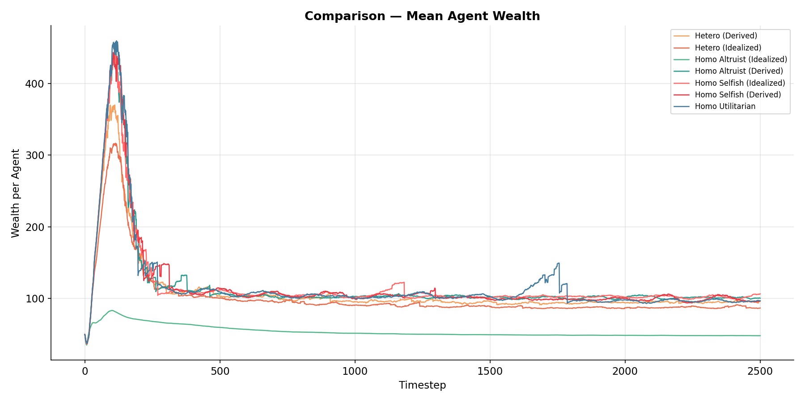

Mean agent wealth rose sharply from about 40–50 wealth units per agent at timestep 0 to early peaks around timestep 100–150, then declined and stabilized. The highest short-term peaks occurred in the homo altruist derived, homo selfish idealized, and homo selfish derived conditions, which reached about 350–360 wealth units per agent, while the homo utilitarian condition peaked slightly lower at 330–340 units. These gains were not sustained: by timestep 2500, most derived, selfish, and utilitarian conditions stabilized near 88–92 units per agent. The heterogeneous derived condition ended lower at about 80 units, while heterogeneous idealized and homo altruist idealized showed the weakest long-term outcomes, ending near 67–70 and 47–50 units, respectively. Overall, the results suggest that high early wealth accumulation did not lead to sustained long-term mean agent wealth.

---

#### Figure 5: Mean Time-to-live of Initial Population Conditions Per Time Step Across 500 seeds

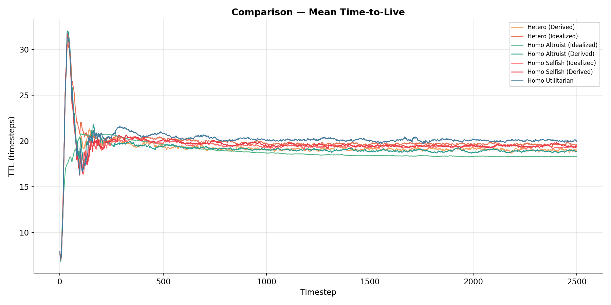

Mean TTL increased rapidly from about 7–8 timesteps at timestep 0 to early peaks of roughly 26–30 timesteps within the first 50–75 timesteps, then declined and stabilized. The homo altruist derived condition performed best, peaking near 29.5 timesteps and ending around 20 timesteps by timestep 2500. Most other conditions, including the heterogeneous, homo utilitarian, and homo selfish derived groups, converged near 19.0–19.5 timesteps by the end of the simulation. The main exception was homo altruist idealized, which rose more gradually and ended lowest at about 17.5 timesteps. Overall, early TTL gains were temporary, and most groups showed similar long-term survival performance.

---

#### Figure 6: Mean Deaths per Population of Initial Population Conditions Per Time Step Across 500 seeds

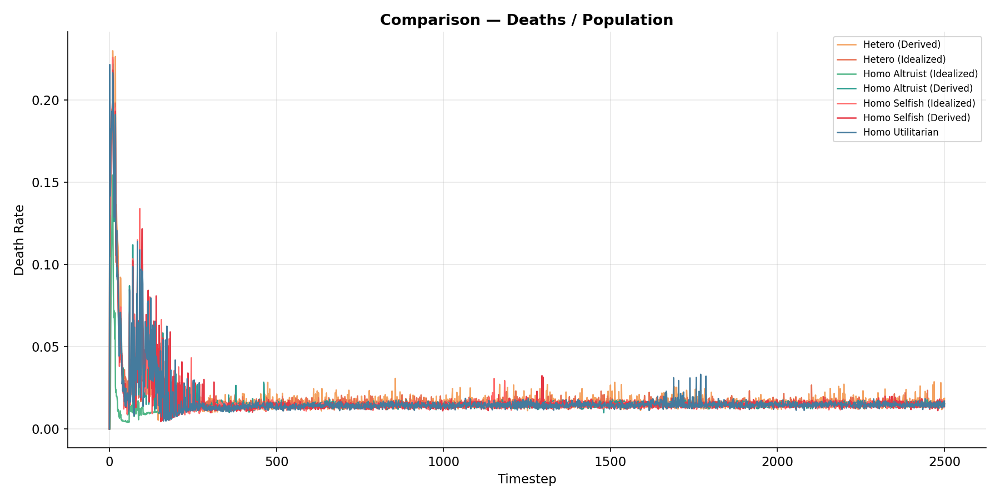

Deaths per population showed a sharp early mortality spike from near 0.00 to about 0.12–0.24 within the first 10–20 timesteps, followed by rapid decline and long-term stabilization near 0.01–0.02. The homo selfish idealized condition had the highest early spike at roughly 0.24, while homo selfish derived, homo utilitarian, and homo altruist derived peaked around 0.20–0.22; the heterogeneous conditions peaked slightly lower at about 0.18–0.20. The homo altruist idealized condition had the lowest early mortality spike, around 0.11–0.12, but this did not correspond to stronger long-term outcomes in other measures. Overall, mortality differences were mainly early-stage effects, as all conditions converged to similarly low death rates by the end of the simulation.

---

#### Figure 7: Mean Age at Death of Initial Population Conditions Per Time Step Across 500 seeds

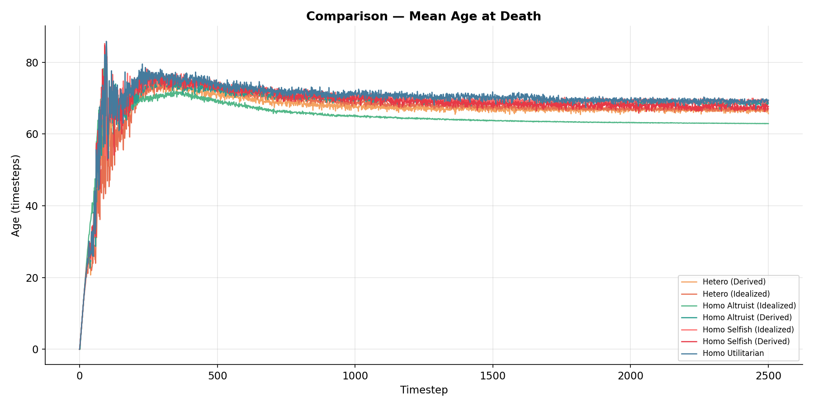

Mean age at death rose quickly from about 0 timesteps to early peaks of roughly 75–90 timesteps, then declined and stabilized. The homo altruist idealized condition reached the highest early peak at about 85–90 timesteps, but ended lowest at approximately 63 timesteps by timestep 2500. In contrast, homo altruist derived had the strongest long-term performance, ending highest at around 69–70 timesteps. Most other conditions, including the homo selfish, homo utilitarian, and heterogeneous groups, stabilized near 66–68 timesteps. Overall, final differences were modest, showing that early lifespan advantages did not necessarily produce better long-term outcomes.

---

### Heterogenous Condition Outcomes

#### Figure 8: Mean Population of Decision-making Models Per Time Step Across 500 seeds in Heterogenous Condition

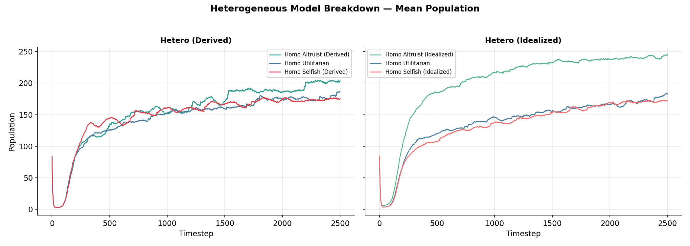

Figure 8 shows that both heterogeneous models experienced an early population collapse, dropping from about 80–85 agents to roughly 5 agents, followed by sustained recovery. The most important difference is that the heterogeneous derived model became balanced over time, with altruist, selfish, and utilitarian agents all ending close together at approximately 175–180 agents by timestep 2500. In contrast, the heterogeneous idealized model strongly favored altruist agents, whose population rose to about 212–215 agents, while selfish and utilitarian agents ended much lower, near 180 agents each. Overall, the derived model showed a more even distribution across agent types, while the idealized model ended with a noticeably higher altruist population.

---

#### Figure 9: Mean Societal Wealth of Decision-making Models Per Time Step Across 500 seeds in Heterogenous Condition

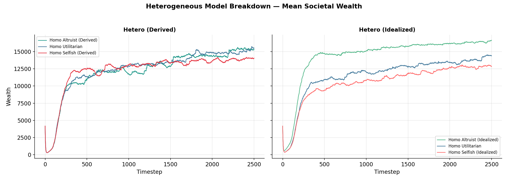

Figure 9 shows that both heterogeneous models experienced an early drop in societal wealth, falling from about 4,200 to roughly 500–700 wealth units, before recovering quickly. In the heterogeneous derived model, selfish and altruist agents generated the highest societal wealth for most of the simulation, ending at approximately 13,000 and 12,400 wealth units, respectively, while utilitarian agents ended slightly lower at around 12,000. In the heterogeneous idealized model, altruist agents had the highest societal wealth throughout most of the simulation, rising to about 13,300 wealth units by timestep 2500, while utilitarian and selfish agents ended lower at approximately 11,600 and 11,300 wealth units, respectively. Overall, the derived model had a more even distribution of wealth across agent types, while the idealized model ended with a noticeably higher altruist wealth level.

---

#### Figure 10: Mean Agent Wealth of Decision-making Models Per Time Step Across 500 seeds in Heterogenous Condition

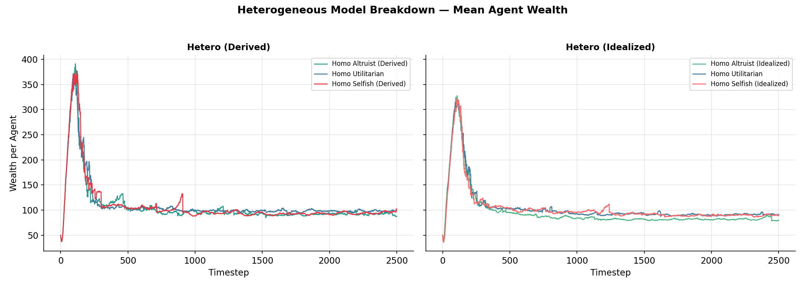

Figure 10 shows that both heterogeneous models had a sharp early increase in mean agent wealth, followed by a steady decline and long-term stabilization. In the heterogeneous derived model, all three agent types peaked at about 290–310 wealth per agent around timestep 100, then declined and ended close together between approximately 78 and 86 wealth per agent by timestep 2500. Altruist agents ended slightly higher at around 85–86, while selfish and utilitarian agents ended near 78–82. In the heterogeneous idealized model, the early peak was lower, reaching only about 200–220 wealth per agent, and all three agent types eventually stabilized even lower, at approximately 68–70 wealth per agent. Overall, the derived model produced higher wealth per agent than the idealized model, but in both cases, differences among altruist, selfish, and utilitarian agents became small by the end of the simulation.

---

#### Figure 11: Mean Time-to-live of Decision-making Models Per Time Step Across 500 seeds in Heterogenous Condition

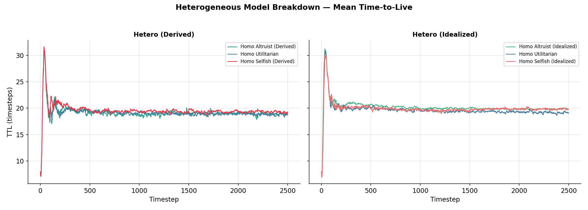

Figure 11 shows that both heterogeneous models had a sharp early increase in mean TTL, followed by gradual decline and stabilization. In the heterogeneous derived model, all three agent types peaked at approximately 27–29 timesteps early in the simulation before declining to around 20–21 timesteps by timestep 300. By timestep 2500, the three groups ended close together at about 19–20 timesteps, with selfish agents slightly higher than altruist and utilitarian agents. In the heterogeneous idealized model, the early peak was slightly lower, reaching approximately 25–26 timesteps, and all three agent types also stabilized near 19–20 timesteps by the end. Overall, mean TTL became very similar across altruist, selfish, and utilitarian agents in both models, suggesting that long-term survival differences among agent types were small.

---

#### Figure 12: Mean Deaths per Population of Decision-making Models Per Time Step Across 500 seeds in Heterogenous Condition

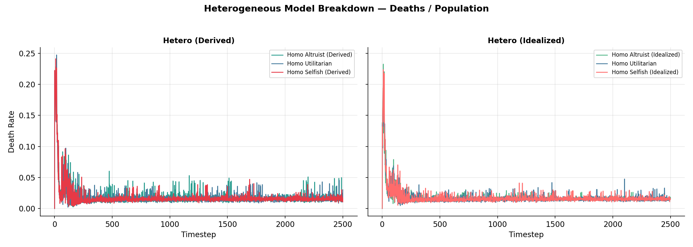

Figure 12 shows that both heterogeneous models had a large early spike in deaths per population, followed by a rapid decline and long-term stabilization. In the heterogeneous derived model, the death rate peaked at about 0.24, with selfish agents showing the highest early spike, while altruist and utilitarian agents peaked lower at roughly 0.11–0.16. In the heterogeneous idealized model, selfish agents again had the highest early spike, reaching about 0.23, followed by utilitarian agents at around 0.16 and altruist agents at about 0.10. After the first 200–300 timesteps, death rates in both models stabilized at approximately 0.01–0.02 across all agent types. Overall, the most important finding is that early mortality was highest among selfish agents, but long-term death rates became very similar across all groups.

---

#### Figure 13: Mean Age of Death of Decision-making Models Per Time Step Across 500 seeds in Heterogenous Condition

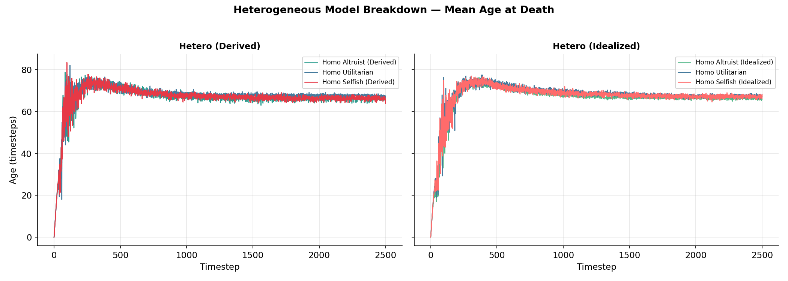

Figure 13 shows that both heterogeneous models had a rapid increase in mean age at death, followed by a gradual decline and long-term stabilization. In the heterogeneous derived model, all three agent types peaked at approximately 73–76 timesteps around timestep 250–350, then slowly declined and ended close together by timestep 2500, with selfish agents slightly higher at about 66–67 timesteps and altruist and utilitarian agents near 64–66 timesteps. In the heterogeneous idealized model, the three groups followed an even more similar pattern, peaking at about 74–76 timesteps and stabilizing near 66–67 timesteps by the end. Overall, mean age at death became very similar across agent types in both heterogeneous models, suggesting that long-term lifespan differences among altruist, selfish, and utilitarian agents were small.

---

### Prioritization Vectors

Below are the prioritization weights derived for each behavioral philosophy (rounded to 4 decimal places):

| Philosophy | Coord 1 (I) | Coord 2 (D) | Coord 3 (P) | Coord 4 (C) | Coord 5 (X) |
| :--- | :--- | :--- | :--- | :--- | :--- |
| **Selfish (Derived)** | -0.0151 | 0.2473 | 0.9466 | 0.1527 | -0.1439 |
| **Altruist (Derived)** | -0.0150 | 0.2476 | 0.9466 | 0.1526 | -0.1437 |
| **Utilitarian (Derived)** | -0.0148 | 0.2475 | 0.9467 | 0.1519 | -0.1396 |
| **Selfish (Idealized)** | 1.0000 | 1.0000 | 1.0000 | 1.0000 | -1.0000 |
| **Altruist (Idealized)** | 1.0000 | 1.0000 | 1.0000 | 1.0000 | 1.0000 |

*Note: The derived models for selfish, altruist, and utilitarian agents ended up generating highly similar vectors, primarily weighting Coordinate 3 very heavily (~0.946).*

---

### FVDM Weights Comparison (Cosine Similarities)

A pairwise cosine similarity analysis of the felicific coordinate functions across different action types revealed the following patterns in the agent's internal evaluations:

**1. Coordinate D (Duration) and P (Propinquity)**
Actions were almost perfectly correlated across these coordinates. Nearly all action pairings (e.g., `TRADE` vs `CREDIT`, `COMBAT` vs `TAGGING`) showed a cosine similarity of `0.98` to `0.99`. This suggests that the model evaluated the duration and propinquity effects of these actions almost identically.

**2. Coordinate I (Intensity)**
The `Intensity` coordinate provided much more differentiation between action types:
*   **High Similarity:** `TRADE` vs `TAGGING` (1.000), `TRADE` vs `CREDIT` (0.920), `CREDIT` vs `TAGGING` (0.920)
*   **Low/Negative Similarity:** `MATE` vs `COMBAT` (-0.086), `MOVE` vs `COMBAT` (0.332)

**3. Coordinate X (Extent)**
The `Extent` coordinate provided the strongest differentiation, featuring heavily opposed vectors:
*   **Strong Negative Correlations:** `MOVE` vs `COMBAT` (-0.865), `MOVE` vs `TRADE` / `TAGGING` (-0.714), `MOVE` vs `CREDIT` (-0.656).
*   **Strong Positive Correlations:** `TRADE` vs `TAGGING` (1.000), `CREDIT` vs `TRADE` / `TAGGING` (0.993), `COMBAT` vs `TRADE` / `TAGGING` (0.932).
